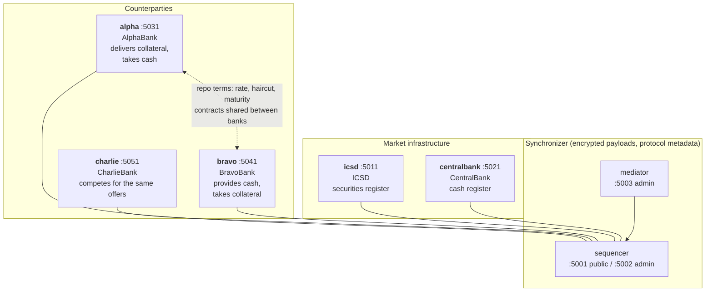

# Canton PoC: repo settlement across two registers

A bilateral repurchase agreement modelled in Daml and settled across separate securities and cash registers on Canton. Five Java desks represent ICSD, CentralBank, AlphaBank and two competing lenders. Both assets exist in the demo ledger; there is no connection to real custody or payment systems.

The setup and command sequence below cover both the automatic demo and a manual run.

## Requirements

The launchers work with Bash on **macOS and Linux**. On Windows, use a Linux environment such as WSL with the tools below available inside it.

Maven, the Canton console and the CLI use the same JDK selection. Set `JDK21` to select an installation explicitly. Otherwise, the launchers look for a Java 21 JDK in `JAVA_HOME`, then on `PATH`, and finally through `/usr/libexec/java_home` on macOS. Installations without Java 21 and its compiler are skipped during automatic discovery.

| Tool | Required version / purpose |
|---|---|
| Java **JDK 21** | Compiles the app and runs the CLI and Canton console; a JRE alone is insufficient |
| Daml SDK **3.4.11**, with `daml` on `PATH` | Builds and tests the model; pinned in `canton/model/daml.yaml`, `canton/test/daml.yaml` and the Makefile |
| Maven **3.9.x** | Builds the Java application and downloads code-generation dependencies |
| Docker with **Compose v2** | Runs eight containers; the Docker engine must already be running |
| Python **3** | Serves the optional trace page via `http.server`; not used by the desks |
| Git, make, Bash, curl, tar, uuidgen | Checkout, build scripts, downloads and demo command IDs |

Canton nodes are pinned to **3.5.15**, protocol **35**. `make up` downloads that release and builds the image; you do not need a separately installed Canton executable. The node version is in [.env](.env). The Daml SDK and Java bindings are pinned separately to 3.4.11; these are the project's chosen versions, not a claim about the latest releases.

The initial build needs internet access to download the SDK, Canton, Maven dependencies and Docker images. Docker must have memory for seven Canton JVMs (each configured with a 768 MiB maximum heap), PostgreSQL and container overhead; the build and five desks also use host memory. A minimum machine size has not been benchmarked.

## Prepare the tools

Install a JDK 21 distribution, such as [Eclipse Temurin](https://adoptium.net/temurin/releases/?version=21), [Maven](https://maven.apache.org/install.html), and Docker with Compose v2. Start Docker before continuing.

On macOS, Docker Desktop supplies Docker and Compose. Install Apple's Command Line Tools if `make` is missing (`xcode-select --install`). On Linux, install Docker Engine and the Compose plugin or use Docker Desktop. Ensure `uuidgen` is available for the demo script.

For this repository's existing `daml` commands, install the pinned SDK using the [Daml Assistant installation procedure](https://archived.docs.digitalasset.com/build/3.4/component-howtos/smart-contracts/assistant.html):

```bash
curl -fsSL https://get.daml.com/ -o /tmp/canton-poc-daml-install.sh
sh /tmp/canton-poc-daml-install.sh 3.4.11
export PATH="$HOME/.daml/bin:$PATH"
```

If the Assistant is already installed, `daml install 3.4.11` adds the required SDK. The Assistant is deprecated; Digital Asset recommends [DPM](https://archived.docs.digitalasset.com/build/3.4/dpm/dpm.html). This Makefile still invokes `daml`, so installing only `dpm` does not satisfy its current requirements. Migration to DPM has not been validated here.

If Java 21 is already on `PATH`, no extra JDK configuration is needed. To select a particular installation on either platform, set its directory:

```bash
export JAVA_HOME="/path/to/jdk-21"
export PATH="$JAVA_HOME/bin:$PATH"
```

On macOS, the installation directory can also be found with:

```bash
export JAVA_HOME="$(/usr/libexec/java_home -v 21)"
export PATH="$JAVA_HOME/bin:$PATH"
```

Check the tools before starting the demo:

```bash
java -version
javac -version
mvn -version
daml version
docker compose version
docker info
python3 --version
```

Confirm Java and Maven use JDK 21, SDK 3.4.11 is installed, and `docker info` reaches the running engine. Persist the PATH/JAVA_HOME settings in your shell configuration if needed. No editor extension is required to run the demo.

## Run the complete demo

From the repository root, on an empty demo ledger:

```bash
make presentation
```

This starts the containers, compiles and uploads the model, allocates the parties, writes `ledger.properties`, builds `app/target/repo-cli.jar`, and runs [scripts/presentation.sh](scripts/presentation.sh). The script starts all five desks, creates the holdings and policies, quotes a repo to both lenders, settles the opening, advances to the agreed repurchase date, and settles the closing.

The script waits for settlement readiness and checks that the dealer no longer has an active REPO-1 after closing. It prints final holdings, then stops the desks. Containers and database contents remain. Either lender can win; the contractual calendar can change the term and interest. A one-calendar-day example borrows 349,624,375.00 EUR against 365 million nominal and pays 33,991.26 EUR interest at 3.5% ACT/360.

For a **fresh rerun**, `make clean` deletes the demo databases, disclosure folders and generated artifacts. Use it only when you want to discard that state:

```bash
make clean
make presentation
```

`make down` stops the containers while preserving data. `make up` starts them again. Repeating `make market` is not a general idempotent operation: `end-of-day` advances the date.

## Run the walkthrough manually

```bash
make up
make bootstrap
make cli
```

Run each of the following in its own terminal and leave it running:

```bash
make desk ROLE=ICSD
make desk ROLE=CentralBank
make desk ROLE=AlphaBank
make desk ROLE=BravoBank
make desk ROLE=CharlieBank
```

Wait for each desk to report `taking instructions`, then create the market, publish both lenders' policies and propose the trade:

```bash
make market
make policy
make repo
```

The desks keep reacting between commands. Either lender can win. Check the lenders' `trades` output and wait for the winner's opening cash allocation before settling. For a run won by BravoBank:

```bash
./bin/repo --as BravoBank trades
./bin/repo --as CharlieBank trades
./bin/repo --as BravoBank settle REPO-1
./bin/repo --as AlphaBank trades
```

Use `--as CharlieBank` for settlement if CharlieBank won. Read the agreed repurchase date from AlphaBank's `trades` output, then run `make roll-date TO=YYYY-MM-DD` with that date. Wait for AlphaBank to reserve the repayment cash and the lender to reserve the securities for return. Complete the repurchase and inspect the result:

```bash
./bin/repo --as AlphaBank settle REPO-1
```

If settlement returns exit code 2 because an allocation has not arrived, wait for the relevant desk to process it before retrying. For failures or uncertain outcomes, follow the retry rules below.

```bash
./bin/repo --as AlphaBank positions
./bin/repo --as AlphaBank cash
./bin/repo --as AlphaBank trades
make check
```

The first three query a running desk. `make check` queries active contracts through the participant APIs; it does not enumerate every record in their databases. If you ran the automatic demo, restart the desired desk before using its query commands.

## Commands, retries and failures

Use `./bin/repo --help` and `./bin/repo --as AlphaBank propose --help` for options. ICSD supports `register` and `issue`; CentralBank supports `fund` and `end-of-day`; lenders publish policies; AlphaBank commits collateral and proposes trades. `settle` is instructed by the payer of the relevant leg.

CLI replies use exit code **0** for successful execution or a query, **2** when an instruction produced no ledger command (for example, settlement is not ready), and **1** for a failure. Read the message: code 2 can also mean the requested state already exists. After rebuilding the CLI, restart existing desks because the local request/reply format changed.

Each new CLI instruction gets a new request ID, printed before sending. `--again` intentionally issues or funds again. To retry the *same* instruction after an uncertain result, reuse its printed ID with `--request-id <id>` and keep its arguments unchanged. Deduplication uses the participant's configured window; IDs are not a permanent exactly-once guarantee. The app has no durable command journal or automatic reconciliation of an unknown submission result. A timeout does not prove the transaction failed.

If the update stream fails or ends, the desk stops and closes its instruction listener. Restart it with `make desk ROLE=...` after the participant recovers; it rebuilds its view from ledger history. It does not reconnect automatically. Temporary command failures are kept separate from model rejections; independent automatic decisions continue after an individual rejection.

## Watch the transaction table

After starting the demo, open another terminal in the repository root and run:

```bash
make watch-trace
```

Open [http://localhost:8080/trace.html](http://localhost:8080/trace.html) to see the transaction table. The script attempts to open the browser with `open` on macOS or `xdg-open` on Linux. If no desktop browser is available, it keeps running and prints the address. Each institution has its own column, showing the events visible to that participant. Rows are grouped by transaction ID, so the table shows how the same transaction appears to different institutions.

The script serves the page with Python 3 and refreshes its data every three seconds. Leave the terminal running while using the table. Press **Ctrl-C** to stop the watcher and web server.

The Canton containers must be running, bootstrap must have created `ledger.properties`, and the CLI must be built. `make presentation` prepares these. The table reads the participant APIs directly, so it also works after the automatic demo stops the Java desks, as long as the containers remain running.

To use a different port or refresh interval:

```bash
PORT=9000 ./web/trace-watch.sh 5
```

This serves the table at `http://localhost:9000/trace.html` and refreshes its data every five seconds. To print the trace once in the terminal instead:

```bash
./bin/repo trace
```

The trace reads all five participant APIs for demonstration purposes. Committed rows use ledger effective times, while refusal rows use local attempt times. These timestamps do not measure latency, and clock-time sorting does not reliably order a history spanning multiple days.

## What is running



Five participants, one sequencer, one mediator and PostgreSQL run in eight containers. PostgreSQL holds seven separate databases in one instance. The five desks run as host-side Java processes. Participants validate their transaction portions; the sequencer and mediator coordinate using encrypted payloads and protocol metadata.

| Institution | Ledger API | JSON API | Admin API | Desk socket |
|---|---|---|---|---|
| ICSD | 5011 | 7011 | 5012 | 6011 |
| CentralBank | 5021 | 7021 | 5022 | 6021 |
| AlphaBank | 5031 | 7031 | 5032 | 6031 |
| BravoBank | 5041 | 7041 | 5042 | 6041 |
| CharlieBank | 5051 | 7051 | 5052 | 6051 |

The sequencer uses 5001/5002, mediator 5003 and PostgreSQL 5432. These ports must be available; trace uses 8080 by default. Desk sockets bind to loopback. Compose's published node/database ports have no explicit loopback binding.

## Limits and Canton guidance

The model uses propose/accept, consuming choices and explicit disclosure. It checks the identities, assets, amounts, references and business date for each settlement. Opening and closing are each atomic; acceptance does not guarantee eventual funding or repayment, and holds can be released before settlement.

Remaining limits include simplified calendars and valuation, no margining or default close-out, no external asset backing, shared local storage, no API TLS/authentication, no redundancy, no durable projection or command journal, and no tested capacity or recovery plan. The local host operator can access all institutions' data.

These operational gaps remain despite the contract patterns used here. This PoC is not a production reference deployment.

## Layout

- `canton/model/`: Daml model; `canton/test/`: separate Daml Script package.
- `canton/conf/`, `canton/bootstrap.canton`: node configuration and bootstrap.
- `docker/`: image, Compose topology and database initialization.
- `app/`: Java actors, ledger adapter, CLI and tests.
- `web/`: trace page and local server script.
- [scripts/presentation.sh](scripts/presentation.sh): complete automatic demo.
